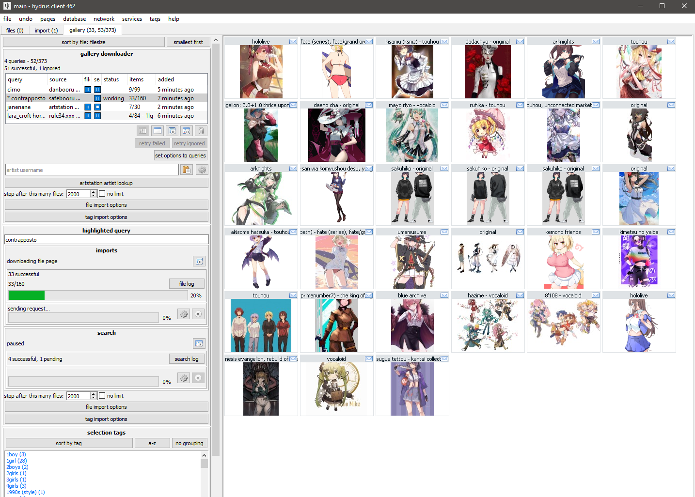

# Getting started with downloading

The hydrus client has a sophisticated and completely user-customisable download system. It can pull from a variety of sources but mostly very simple sites.

**A fresh install starts without any downloaders**, so you must add what you wish to use yourself. Users [can share downloaders](adding_new_downloaders.md), and it _is_ also possible, with some work, for any user to [create a new downloader themselves](downloader_intro.md) for a new site.

The downloader is highly parallelisable, but the default [bandwidth rules](#bandwidth) should stop you from running too hot to start out.

!!! danger
    It is very important that you take this slow. Many users get overexcited with their new ability to download a ton of things _and then do so_, only discovering later that 98% of what they got was junk that they now have to wade through. Figure out what workflows work for you, how fast you process files, what content you _actually_ want, how much bandwidth and hard drive space you have, and prioritise and throttle your incoming downloads to match. If you can realistically only archive/delete filter 50 files a day, there is little benefit to downloading 500 new files a day.
    
    START SLOW.

It also takes a decent whack of CPU to import a file. You'll usually never notice this with just one hard drive import going, but if you have twenty different download queues all competing for database access, those individual 0.1-second CPU hits will add up to some judder and lag. Keep it in mind, and you'll figure out what your computer is happy with. I also recommend you try to keep your total in-session urls to be under 20,000 to keep things snappy. Remember that you can always pause your import queues, if you need to calm things down a bit.

## Downloader types

There are several different downloader types, each with its own purpose:  

**Gallery**
:    A typical booru-style search interface. You enter tags, and the downloader walks through one or more gallery pages, queueing up many post/file results.

**Subscriptions**
:    Automatic, repeating gallery jobs, for keeping up to date with a particular search. **Use the gallery downloader to get everything first** and then set up a subscription to keep updated with new things.

**Watcher**
:    For watching imageboard threads. It checks and rechecks regularly to keep up with new posts. (The [API](client_api.md) can send URLs to this)

**URL download**
:    You paste or drag-and-drop gallery and post/file URLs into this, and if hydrus understands it, it will import it. Does not do multi-page searching. Useful for one-off jobs. (The [API](client_api.md) can send URLs to this)

**Simple downloader**
:    Advanced. Intended for simple one-off jobs with a single simple parsing rule, like 'get all the linked images from this page'.

### Gallery download

!!! warning
    The file limit and import options on the upper panel of a gallery or watcher page, if changed, will only apply to **new** queries. If you want to change the options for an existing queue, either do so on its highlight panel below or use the 'set options to queries' button.

The gallery page can download from multiple sources at the same time. Each entry in the list represents a basic combination of two things:

**Source**
:   The site you are searching.

**Query text**
:   Something like 'contrapposto' or 'blonde\_hair blue\_eyes' or an artist name. Whatever is searched on the site to return a list of ordered media.

So, when you want to start a new download, you first select the source with the button and then type in a query in the text box and hit enter. The download will soon start and fill in information, and file thumbnails should slowly appear, just like the hard drive importer. The downloader typically works by walking through the search's gallery pages one by one, queueing up the found files for later download. There are several intentional delays built into the system, so do not worry if work seems to halt for a little while--you will get a feel for hydrus's 'slow persistent growth' style with experience.

The thumbnail panel can only show results from one queue at a time, so double-click on an entry to 'highlight' it, which will show its thumbs and also give more detailed info and controls in the 'highlighted query' panel. I encourage you to explore the highlight panel over time, as it can show and do quite a lot. Double-click again to 'clear' it.

It is a good idea to 'test' larger downloads, either by visiting the site itself for that query, or just waiting a bit and reviewing the first files that come in. Just make sure that you _are_ getting what you thought you would, whether that be verifying that the query text is correct or that the site isn't only giving you bloated gifs or other bad quality files. The 'file limit', which stops the gallery search after the set number of files, is also great for limiting fishing expeditions. If the gallery search runs out of new files before the file limit is hit, the search will naturally stop (and the entry in the list should gain a ⏹ 'stop' symbol).

_Note that some sites only serve 25 or 50 pages of results, despite their indices suggesting hundreds. If you notice that one site always bombs out at, say, 500 results, it may be due to a decision on their end. You can usually test this by visiting the pages hydrus tried in your web browser._

**In general, particularly when starting out, artist searches are best.** They are usually fewer than a thousand files and have fairly uniform quality throughout.

### Subscriptions { id="subscriptions" }
Let's say you found an artist you like. You downloaded everything of theirs from some site using a Gallery Downloader, but every week, one or two new pieces is posted. You'd like to keep up with the new stuff, but you don't want to manually make a new download job every week for every single artist you like.

Subscriptions are a way to automatically recheck a good query in future, to keep up with new files. Many users come to use them. You set up a number of saved queries, and the client will 'sync' with the latest files in the gallery and download anything new, just as if you were running the download yourself.

!!! info "Sync Mechanics"
    Because they are automatic, subscriptions are designed to be reliable, simple, and fail-safe. They build up an initial list of URLs (usually one hundred) for their search, and then on every normal sync they will re-run the search and stop looking once they hit a list of files they recognise.
    
    Once subscriptions establish a log of recent URLs, they will not go 'beyond' that, to older URLs. They will always get whatever is newest, stop when they catch up to what they have seen before, and integrate those newer URLs into their URL log for the next check.
    
    If you need to get older files and fill in that 'gap', use a one-time Gallery Downloader page.
    
    Subscriptions change how frequently they check based on what they see. If it looks like there are four new files every week, they will typically try to check once a week. A faster or slower 'file velocity' will cause them to automatically throttle up or down. If a source does not post any new files within a long time (usually 180 days), the subscription will be considered DEAD and will stop checking.
    
    **The entire subscription system assumes the source is a typical 'newest first' booru-style search. If you dick around with some order_by:rating/random metatag, it will not work reliably!**

While subscriptions can have multiple queries (even hundreds!), they _generally_ only work well on one site at a time. Expect to create one subscription for site x, another for site y, site z, and so on for every source you care about. Advanced users may be able to think of ways to get around this and have a single sub that checks three different sites, but I recommend against it as it throws off some of the internal check timing calculations.

#### Setting up subscriptions

Hit up the dialog, which is under _network->manage subscriptions_. Click 'add' to create a new subscription, select a download source, and then add your queries.

!!! danger
    **Do not change the max number of new files or checker options until you know _exactly_ what they do and have a good reason to alter them!**
    
    Subscriptions syncs work best in the small ~100 file range. Do not try to play with the limits or checker options to download a whole 5,000 file query in one go--**if you want everything for a query, run it in the manual gallery downloader first**, then set up a normal sub for new stuff. A super-large subscription **gives no benefit** and can run into several problems.

Subscriptions have rich and powerful UI. Despite all the controls, the basic idea is simple: When the subscription runs, it will put the given search text of each query into the given download source just as if you were running the regular downloader. It reviews what comes back and compares that to what it has seen before. If there are any new files, it works on them.

You might want to put subscriptions off until you are more comfortable with galleries. There is more help [here](getting_started_subscriptions.md).

### Watchers
If you are an imageboard user and find a downloader for that imageboard, try going to a thread you like and drag-and-drop its URL (straight from your web browser's address bar) onto the hydrus client. It should open up a new 'watcher' page and import the thread's files!

With only one URL to check, watchers are a little simpler than gallery searches, but as that page is likely receiving frequent updates, it checks it repeatedly until it dies. By default, the watcher's 'checker options' will regulate how quickly it checks based on the speed at which new files are coming in--if a thread is fast, it will check frequently; if it is running slow, it may only check once per day. When a thread falls below a critical posting velocity or 404s, checking stops and it is set DEAD.

In general, you can leave the checker options alone, but you might like to revisit them if you are always visiting faster or slower boards and find you are missing files or getting DEAD too early.

#### API
If you use [API-connected](client_api.md) programs such as the Hydrus Companion, then any [watchable](downloader_url_classes.md#url_types) URLs sent to Hydrus through them will end up in a watcher page, the specifics depending on the program's settings.

### URL download
The **url downloader** works like the gallery downloader but does not do searches. You can paste downloadable URLs to it, and it will work through them as one list. Dragging and dropping recognisable URLs onto the client (e.g. from your web browser) will also spawn and use this downloader.

The button next to the input field lets you paste multiple URLs at once such as if you've copied from a document or browser bookmarks. The URLs need to be newline separated.

#### API
If you use [API-connected](client_api.md) programs such as the Hydrus Companion, then any [non-watchable](downloader_url_classes.md#url_types) URLs sent to Hydrus through them will end up in an URL downloader page, the specifics depending on the program's settings. You can't use this to force Hydrus to download paged galleries since the URL downloader page doesn't support traversing to the next page, use the gallery downloader for this.

### Simple downloader
The **simple downloader** will do very simple parsing for unusual jobs. If you want to download all the images in a page, or all the image link destinations, this is the one to use. There are a couple default parsing rules to choose from, and if you learn the downloader system yourself, it will be easy to make more.

## Import options

Every import in Hydrus operates under a flexible set of 'import options' that change what is allowed, what file properties or tags are blacklisted, and whether metadata like tags or notes should be saved. The defaults for this system are fine, but if you wish to read more, the full help is [here](getting_started_import_options.md).

### Tag Parsing

By default, hydrus starts with a local tag domain called 'downloader tags' and it will parse (get) all the tags from normal gallery sites and put them in this service. You don't have to do anything, you will get some decent tags. As you use the client, you will figure out which tags you like and perhaps decide you want them to go to different areas. Revisit the import options help when you are ready to make decisions here.

#### Force Page Fetch

By default, hydrus will not revisit web pages or API endpoints for URLs it knows A) refer to one known file only, and B) that file is already in your database or has previously been deleted. This means if you run a normal download twice, hydrus will not fetch the tags that second time.

If you mess up your tag import options the first time and need to re-run a download, right-click a selection of thumbnails and hit `urls->force metadata refetch`. This creates a new page with special Prefetch Import Options allowing for refetching the tags (while still skipping the actual file redownload)!

### Note Parsing

Hydrus also parses 'notes' from some sites. This generally means the comments that artists leave on certain gallery sites, or something like a tweet text. Notes are editable by you and appear in a hovering window on the right side of the media viewer.

## Bandwidth

**Hydrus deals with very large numbers of files, and its file store is expected to last many years. Its downloaders are designed to run a marathon, not a sprint.**

It will not be too long until you see a "bandwidth free in xxxxx..." message. As a long-term storage solution, hydrus is designed to be polite in its downloading--both to the source server and your computer. It has complicated bandwidth rules that can operate in several different domains, and the default rules are capped conservatively to stop big mistakes and spread out larger jobs. For instance, at a bare minimum, no domain will be hit more than once a second.

If you want to download a heap of files, set up the queue and let it work. The client will take breaks, likely even to the next day, but it will get there in time. Many users like to leave their clients on all the time, just running in the background, which makes these sorts of downloads a breeze.

That said, all the bandwidth rules are completely customisable and are found in `network->data->review bandwidth usage and edit rules`. They can get quite complicated.

This main 'review' panel shows where you have been downloading from. It also displays current usage and if a particular domain is currently blocked due to the rules.

When a new network job appears, it will belong to multiple 'contexts'--usually, it will be 'global', any domain and subdomains, and then 'downloader page', 'subscription', or 'watcher page' (which are special contexts that attach to the particular downloader)--and all of these have to pass in order for the job to start. If 'site a' is blocked but 'global' is ok, then a request to 'site b' will start immediately; if 'global' is blocked, then nothing will work.

You can double-click any row to see more detail:

A context will start using the 'default' rules, but if you like you can set specific rules for one you want to be careful or aggressive with. To edit the default rules, go back to the main 'review' panel. If you find your network jobs are halting too much, you probably want to relax the daily rules for 'web domain' default and then the 'global' context specifically.

I **strongly** recommend you not poke around here until you have more experience. I **especially strongly** recommend you not ever turn them all off, thinking that will improve something, as you'll probably render the client too laggy to function and get yourself an automatic IP ban from the next server you pull from.

Again: the real problem with downloading is not finding new things, it is keeping up with what you get. Start slow and figure out what is important to your bandwidth budget, hard drive budget, and free time budget. Almost everyone fails at this.

## Logins

!!! warning
    Never use important accounts with hydrus. Hydrus does not store credentials securely. You can also lose an account if the site suddenly changes their policies and bonks it. If you link an account to hydrus, always use a throwaway account you don't care much about.

**This system is ancient, often breaks, and is a hassle deal with! If you need to log in to anything more clever than a completely open booru, copy your cookies across instead with Hydrus Companion or similar!**

The client supports a very basic and ugly login system. It can handle simple sites and is as [completely user-customisable as the downloader system](downloader_login.md). The client starts empty, but a downloader may come with a login script. You can review these under _network->logins->manage login scripts_ and _network->logins->manage logins_.

Some sites grant all their content without you having to log in at all; others require it for certain content; you may also wish to take advantage of site-side user preferences like personal blacklists.

To start using a login script, select the domain and click 'edit credentials'. You'll put in your username/password, and then 'activate' the login for the domain, and that should be it! The next time you try to get something from that site, the first request will wait (usually about ten seconds) while a login popup performs the login. Most logins last for about thirty days (and many refresh that 30-day timer every time you make a new request), so once you are set up, you usually never notice it again, especially if you have a subscription on the domain.

The login system is not very clever. Don't try to pull off anything too advanced with it. If you would like to login to a site that is too advanced for this, you have several options:

1. Get a web browser add-on that lets you export a cookies.txt (either for the whole browser or just for that domain) from a browser that is logged in, and then drag and drop that cookies.txt file onto the hydrus _network->data->review session cookies_ dialog. This sometimes does not work if your add-on's export formatting is unusual. If it does work, hydrus will import and use those cookies, which skips the login by making your hydrus pretend to be your browser directly. This is obviously advanced and hacky, so if you need to do it, let me know how you get on and what tools you find work best!
2. Use [Hydrus Companion](https://gitgud.io/prkc/hydrus-companion) browser add-on to do the same basic thing automatically. This also gives hydrus the browser's `User-Agent` header, which some logins or CDN gateways sync to their cookie record.
3. Use a different downloader system and import to hydrus manually.

## Difficult Sites

Some sites are just too complicated for the hydrus downloader engine. In these cases, it can be best just to go to an external downloader program that is specially tuned for these complex sites.

It takes a bit of time to set up these sorts of programs--and if you get into them, you'll likely want to make a script to help automate their use--but if you know they solve your problem, it is well worth it!

- [yt-dlp](https://github.com/yt-dlp/yt-dlp) - This is an excellent video downloader that can download from hundreds of different websites. Learn how it works, it is useful for all sorts of things!
- [gallery-dl](https://github.com/mikf/gallery-dl) - This is an excellent image and small-vid downloader that works for all sorts of places.
- [hydownloader](https://gitgud.io/thatfuckingbird/hydownloader) - An advanced Hydrus Client API tool that uses gallery-dl under the hood.
- [imgbrd-grabber](https://github.com/Bionus/imgbrd-grabber) - Another excellent, mostly booru downloader, with an UI. You can export some metadata to filenames, which you might like to then suck up with hydrus filename-import-parsing.

With these tools, used manually and/or with some scripts you set up, you may be able to set up a regular import workflow to hydrus (especilly with an `Import Folder` as under the `file` menu) and get _most_ of what you would with an internal downloader. Some things like known URLs and tag parsing may be limited or non-existant, but it is better than nothing, and if you only need to do it for a couple sources on a couple sites every month, you can fill in the most of the gap manually yourself.

Hydev is planning to roll out better support for external executables, folding them into the native import workflows, hopefully in 2026™.
