!!! warning "THIS IS NEW"
    This is a new system! All users will be migrated on v671 from the old file/tag/note options to a seven-part system!
    
    I am happy with the technical side of this, but it is not the most user-friendly. Most users never need to touch it, but if you frequently play around with custom import options, let me know what works well and badly and what in here or the UI is confusing.

# Import Options

There are several ways to import files to hydrus, whether that is a drag-and-drop import from your hard drive, a downloader pulling from a site, or a file you push through the Client API. Imports may come with additional metadata like tags or URLs. Sometimes you want to grab everything available and keep it all attached, and sometimes you want to say 'only get the jpegs', or 'send just these tags here'.

We control how importers make their decisions using "Import Options", which is an umbrella term for a selection of sub-options. Import Options are sophisticated and are designed to be set up ahead of time. You rarely touch them in normal operation.

!!! warning "tl;dr"
    This stuff can get crazy. If you are a new user, rest assured the default setup here is fine, and you do not need to learn all this ASAP. You never _need_ to learn all this. You can just let stuff work and slowly dip your toes in if and when you need it to work differently. Some things you can do with this system are:
    
    - sending tags to different locations, force-adding tags
    - sending files to different locations, auto-archiving
    - skipping imports based on file properties or tags
    
    So, feel free to ignore this page for now and come back if and when you have these sorts of needs.

If you would like to learn more now, then know that every file import is assigned multiple types of Import Options:

- **Prefetch Import Options**: This tells a downloader whether to skip redownloading a recognised file or its metadata to save time. Edit this when you need a downloader to force-fetch something.
- **File Filtering Import Options**: This tells an importer which types of files it should allow. Edit this if you need to exclude very large files or similar.
- **Tag Filtering Import Options**: This tells an importer to blacklist/whitelist a file based on its tags. Edit this if you need to stop all the files with tag x or only allow the files with tag y.
- **Location Import Options**: This tells an importer where to send files and if they should be auto-archived. Edit this if you have multiple local file domains and need to place certain imports in a different location.
- **Tag Import Options**: This tells an importer where to send the tags a file may come with. Edit this if your file downloader parses tags.
- **Note Import Options**: This tells an importer whether to save any parsed 'note' text that comes with a file. Edit this if you want to shape how notes are added.
- **Presentation Import Options**: This tells an importer which of the files it successfully imports it should show in UI. Edit this if you don't want to see, say, files that were already in your database.

Every single import has every one of these, but in many cases the specific options set will have nothing interesting to say or the import may not need to consult it. A local file import, from your hard drive, will not consider the Prefetch Import Options.

## The Defaults System

!!! note "You are in control"
    This is another one of those hydrus systems that has some reasonable defaults but is very user-configurable. You can go down a rabbit hole here, and I won't stop you. Some people need the specificity of URL Class Import Options; most do not. Figure out what works for your situation, and don't put time into anything that isn't broken.

So, how are these Import Options set up for a particular file import? It would be too annoying to set up a whole set of import options every time for each new importer, so instead Hydrus has a sophisticated _defaults_ system, where the different types of import can all add their suggestion on what they thing should happen, so you might say 'in general, all imports should send files to "my files"' and 'in general, all gallery downloads should grab all available tags and send them here'. At the moment of import, the system looks at what is going on, for instance, "we are importing from this URL through this type of page", looks at which suggestions are the most appropriate, and freezes a mix-and-match of the various defined default settings and goes ahead.

**Importantly**, a setting here can abstain, saying, for instance: "subscriptions have no custom note import options". When a layer of options says this, which it does by saying 'use default', it is telling the system to defer to the next most general layer for actual settings to use. Most of the options structure starts like this, not setting anything, and thus most imports will by default use the base 'global' settings.

The 'global' set of Import Options are the backstop that will be used if nothing else involved has any custom Import Options set. The different layers of import type are placed atop the global set, each more specific than the last, and the top-most layer that has a value for each option type is the one selected for the actual import. It is all arranged in a preference stack, like so:

[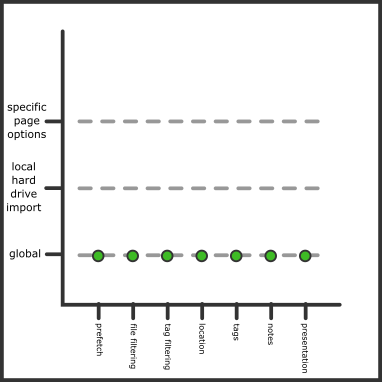](images/import_options_stack_chart_1.png)

This is the default situation for a local hard drive import page. By default, the 'local hard drive import' type has no custom options. Similarly, while every new import context has a "specific import options" attached that _can_ override the defaults, it starts empty every time. Imagine, though, if you did this (and let's say unchecking the 'exclude deleted' checkbox):

[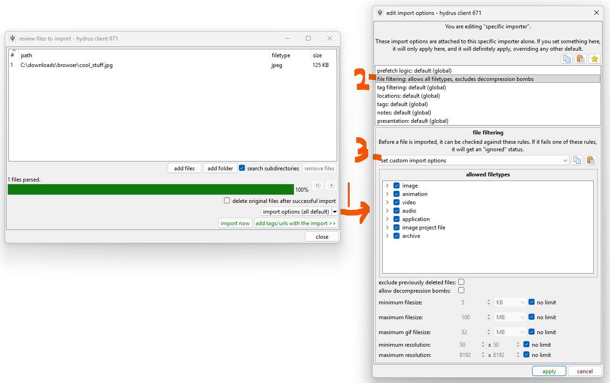](images/import_options_setting_specific_file_filtering.png)

When you apply that, note the button label changes to:

[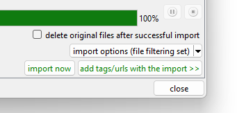](images/import_options_setting_specific_file_filtering_aftermath.png)

We would now have this situation:

[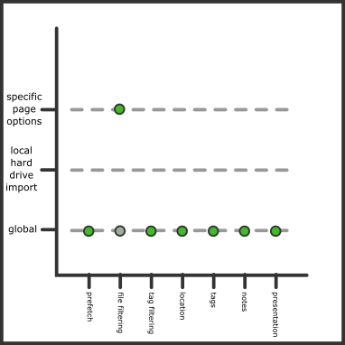](images/import_options_stack_chart_2.png)

We overrode what the global defaults were offering for this import, and this import page will now allow previously deleted files. Every importer has one of these import option buttons, and you can use them for one-time settings for unusual jobs like this.

!!! note "The most specific is selected"
    The most specific pertinent options is the one used, completely overruling whatever is set below.
    
    It is a complete overrule, so in our example here, all the shown file filtering rules will be used, and nothing in what "global" has for file filtering will be used--you cannot say 'do what the lower layer says _and_ also do this'. Consider this as you set up blacklists and so on--don't try to get too clever, or you'll just add maintenance work for yourself as you duplicate rules from lower levels to upper.

Now load up `options->import options`. This is the main dialog where we set up all the defaults:

[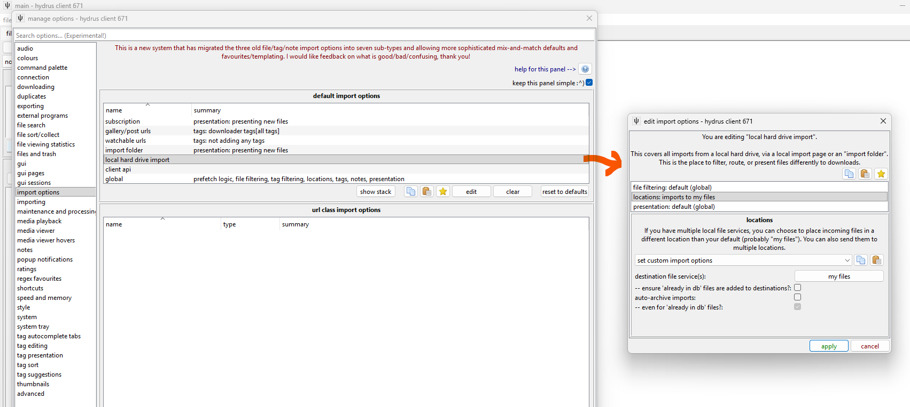](images/import_options_setting_options_defaults.png)

Here we tell hydrus to treat local hard drive imports differently than the global set. If you wanted all your manual file imports to behave a little differently, let's say importing to a place other than "my files", you could set it here and then you wouldn't have to set it specifically every time. Note that hydrus will hide non-pertinent option types from you here (no prefetch, tags, notes). If you poke around a bit, you can force it to show every option type for every context, and some very rare advanced situations might need that, but I recommend you leave this stuff in the simple mode.

In the screenshot we have set custom 'locations' import options. Any new local hard drive import will now start like this:

[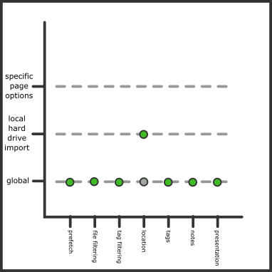](images/import_options_stack_chart_3.png)

We could, of course, always change an upcoming local hard drive import to has its own custom Location Import Options, which would then override our new default:

[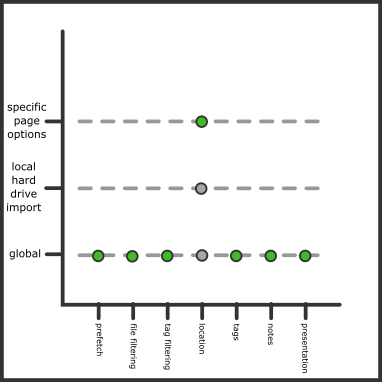](images/import_options_stack_chart_4.png)

Any local import page will first consult its specific settings, then the 'local hard drive import' settings, and then fall back to the globals. You can click 'show stack' on any entry to see what you would be dealing with with an actual importer of that type.

The stack gets more complicated for downloaders. Hydrus now considers the type of URL, so different sites can have different blacklists or tag parsing rules. We also split URLs into two broad categories--'gallery/post urls' and 'watchable urls', which correspond to a gallery downloader page or a thread watcher page (and which, by default, _do_ and _do not_ get tags).

Let's look at subscriptions:

[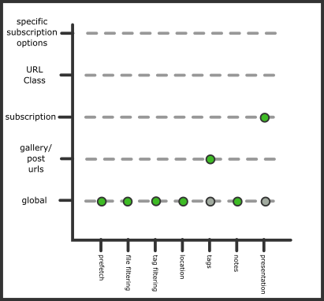](images/import_options_stack_chart_5.png)

If you are a new user, this should be the same default you see, so feel free to check with the options page. What's special?

- In general, we want to grab tags from gallery sites. Most tags from gallery downloaders are mostly good, so the default there is 'yes we want everything', and to pipe them to your "downloader tags" local tags domain. Note that watcher urls do not have any tag parsing--watchers only tend to have filename spam tags and so the default is to not get anything.
- In general, unlike an importer page you are looking at, we don't want subscriptions to spam you (via their buttons or pages) with files you have already dealt with. Sometimes subscriptions overlap or they show things you just downloaded manually yesterday. We tell them to only present "new files", which means stuff that did not get 'already in db'.

If you never want to import any content with the tag "goblin", you could set that up in "Tag Filtering Import Options" for your 'gallery/post urls', and then any normal downloader is going to ignore any such file. If that "goblin" problem only appears on a certain site, you could set it up with the appropriate URL Class. If it only applies to a very specific clever subscription, you can set it up just on that sub in the 'edit subscriptions' dialog.

This is a real-world example that an experienced hydrus user might set up:

[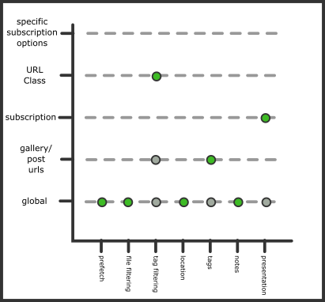](images/import_options_stack_chart_6.png)

If you really want to, you can make different Tag Import Options for every single site, but I recommend you try and keep things simple. Best to have a simple effective setup for "gallery/post urls" and then add URL Class exceptions as needed.

## Import Options In Detail

Let's look at each panel:

### Prefetch Import Options

[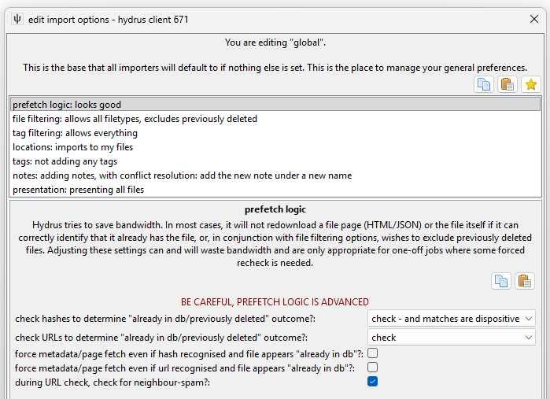](images/import_options_panels_prefetch.png)

**You don't need to touch this guy unless you need to force a downloader to run inefficiently. Stay away!**

By default, hydrus will not revisit web pages or API endpoints for URLs it knows A) refer to one known file only, and B) that file is already in your database or has previously been deleted. The way it navigates this can be a complicated mix of hash and URL data, and in certain logical situations hydrus will determine its own records are untrustworthy and decide to check the source again.

This logic saves bandwidth and time as you run successive queries that include the same results. You should not disable the capability for normal operation.

But what if you mess up your tag import options somewhere and need to re-run a download with forced tag re-fetching?

Set up a new downloader page and give it custom Prefetch Import Options. Check the `force metadata/page refetch even if...` checkboxes. This is the same way the thumbnail `urls->force metadata refetch` menu entry works.

Remember not to set this logic in your defaults--only on one-time downloaders that need it. This method of downloading is inefficient and should not be used for repeating, long-term, or speculative jobs. Only use it to fill in specific holes!

### File Filtering Import Options

[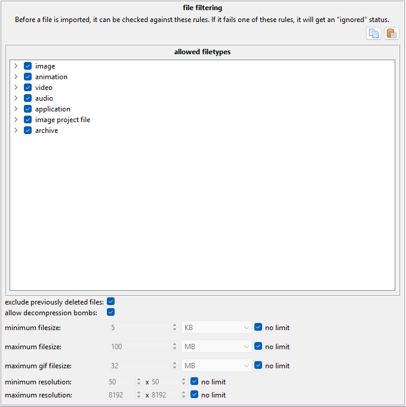](images/import_options_panels_file_filtering.png)

You can choose to ignore files of certain filetypes or set size limits. This is most useful for one-time jobs where you have a big mess of files and don't want to pick through it all to exclude the 32x32 icons or whatever is mixed in. The 'exclude previously deleted' checkbox is important, and in most cases you want it on.

'Decompression bombs' aren't really a big deal these days (the check is really just a num_pixels scan in the early stages of image load, stopping images with a larger than 512MB bitmap, or >~180 megapixels (~12,000x15,000 resolution), so you can leave it on unless you are tight on resources or know you are running into some 5GB lolfiles and want to stop them early.

### Tag Filtering Import Options

[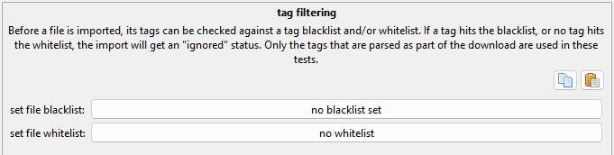](images/import_options_panels_tag_filtering.png)

This is great when you have a downloader that you cannot easily filter with a query. Maybe you want everything by artist 'x', but only their 'y' content. To exclude their 'z' stuff you can set up a blacklist that matches 'z' and any time a file comes with any matching tags, it will be ignored instead of imported. On rare occasion, you may want the slightly different whitelist logic of 'only import if it has "y"'.

This is also useful for your general hatelist. Throw your personal 'diaper', 'vore', 'queen of spades', and such into the 'gallery/post urls' entry and you can skip it all. You'll be looking at something like this:

### Location Import Options

[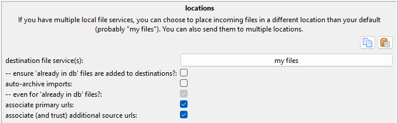](images/import_options_panels_locations.png)

If you end up falling in love with multiple local file domains (which adds places to put files beyond 'my files'), you can drive certain imports into one place, or multiple places.

This is best set up at the global level, and you may want to set up some templates for quick-loading frequent jobs.

### Tag Import Options

[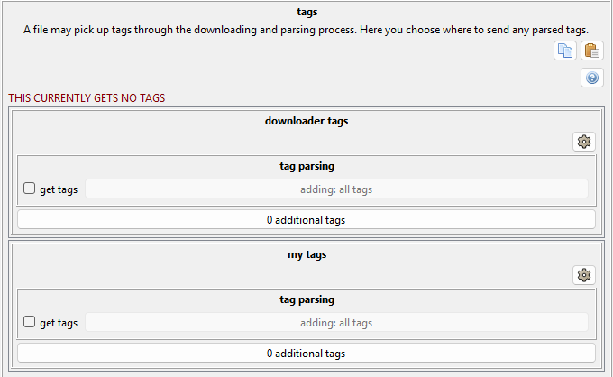](images/import_options_panels_tags.png)

This is a big one. Note that it generally only handles tags from downloaders. The filename tagging you can do via a manual file import already assigns tags to different services and works on a different system. In most cases, a simple 'get tags' click on the place you want downloader tags to land will work, but if you want to get complicated and say 'only creator/series/character tags' and such, you can by clicking the "adding: all tags" tag filter button. There are some turbo-brain settings under the cog menu.

If you add more local tag domains, or a repository like the PTR, they will appear on this panel.

Your "gallery/post urls" are probably set to grab everything and send them to the 'downloader tags' service. If you ever wondered how that worked, here it is! You can change it completely if you like.

The 'additional tags' buttons let you force-add a list of tags to each file being imported. This is useful for one-time jobs, sometimes, that need a special label.

### Note Import Options

[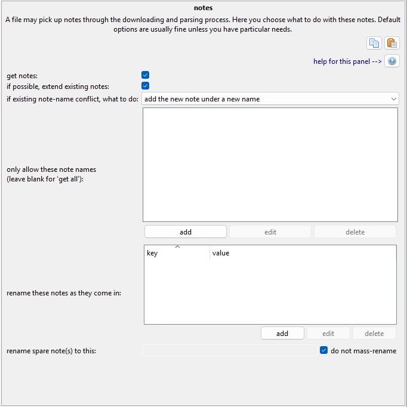](images/import_options_panels_notes.png)

This panel is a mess, and all note deduplication handling is a mess. Leave it on the default settings--or go crazy trying to figure out how it works.

### Presentation Import Options

[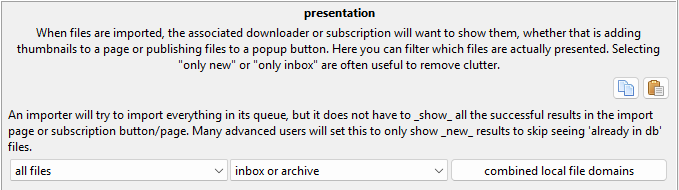](images/import_options_panels_presentation.png)

This is for advanced users. When you get annoyed by seeing old stuff appear in new importers, poke around here.

## Favourites/Templates and Copy/Paste

Ok, so you have played with the system. Let's say you now know, "I want every x downloader to work _exactly this way_," but now you are dreading setting it up on the eight separate URL Classes that might apply. Maybe you are planning a series of local imports that need to be set up _just so_, but again you don't want to make the same options over and over. The good news is everything is copyable to your clipboard and there is a favourites system where you can save whole setups or templates. Throughout the system, you will see these:

[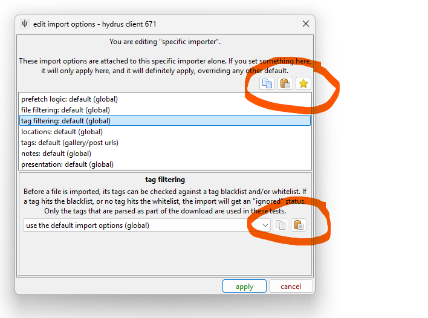](images/import_options_favourites_buttons.png)

The top buttons are:

- Copy all the options managed here
- Paste onto the options managed here
- Load/Edit favourites/templates

The bottom are:

- Copy just this specific type of options
- Paste just onto this specific type of options

Generally speaking, you can just have a play around with the system and you'll get the feel for it.

Since you may be copying from and then pasting onto seven separate sets of options, there are several kinds of paste:

[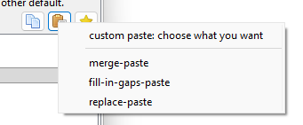](images/import_options_favourites_paste_menu.png)

This may be intimidating, but if you just want what you are looking at to look like what you have in the clipboard, do 'paste-replace'. If you want to preview exactly what is going on, hit the 'custom paste' up top. You'll get this:

[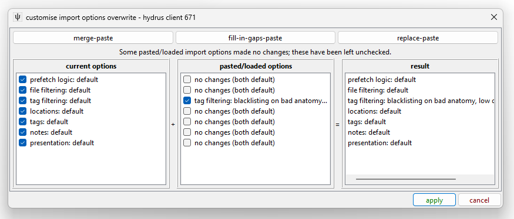](images/import_options_favourites_paste_dialog.png)

The column on the left is what the options are currently; the middle column is what your paste/load has to offer; the right is what the outcome of this overwrite currently looks like. Use the checkboxes to change what you are overwriting.

If you need to set up the same options for twelve URL Classes in a row, set up exactly what you want for one of them and then 'copy' and use the 'replace-paste' on a selection of the rest.

If you have a common setup (for instance, 'import to x local file domain and auto-archive', save it to your favourites! You can load it up quickly to any importer:

[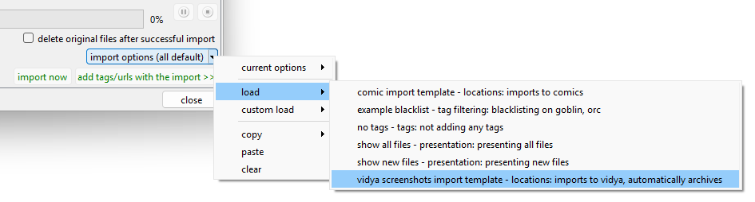](images/import_options_favourites_load.png)

## Advanced URL Class Logic

When the system checks for a URL Class record, it tries several possibilities, and the first match gets set as the vote from the URL Class slice of the stack. It works in this order:

- Primary URL of the import object
- All URLs in any API URL Redirect Chain from the Primary URL, in conversion order.
- Any Referral URL of the import object
- All URLs in any API URL Redirect Chain from the Referral URL, in conversion order.

So, if you have a job for 'somebooru.com/post/123456', the system is going to do lookups on a list something like this:

- somebooru.com/post/123456
- somebooru.com/search?tags=cool_stuff&page=3

And, if there are API URLs in use, something more like this:

- somebooru.com/post/123456
- somebooru.com/post/123456.json
- somebooru.com/search?tags=cool_stuff&page=3
- somebooru.com/search.json?tags=cool_stuff&page=3

Most normal boorus end up with the Gallery URL as the referrer to the Post URL, but if you know anything about URL Classes, you know this _can_ get complicated. Generally, if there is no entry for a site's Post URLs but there is for its Gallery URLs, the Gallery URL entry will be discovered and used. This matters particularly when a site has Gallery URLs (or Watchable URLs) that link directly to files, with no Post URLs defined. Hydrus does its best to figure something out.

Since API URLs _are_ checked, you can decide whether you prefer to set custom import options on the Primary, Human URL Class, or the API URL Class. It only really matters in very complicated multi-domain situations where multiple URL Classes for different sites may point to the same API endpoint.

If it makes you feel better, you can just spam the same custom import options to every URL Class you can find for the site, and hydrus should catch one of them.
